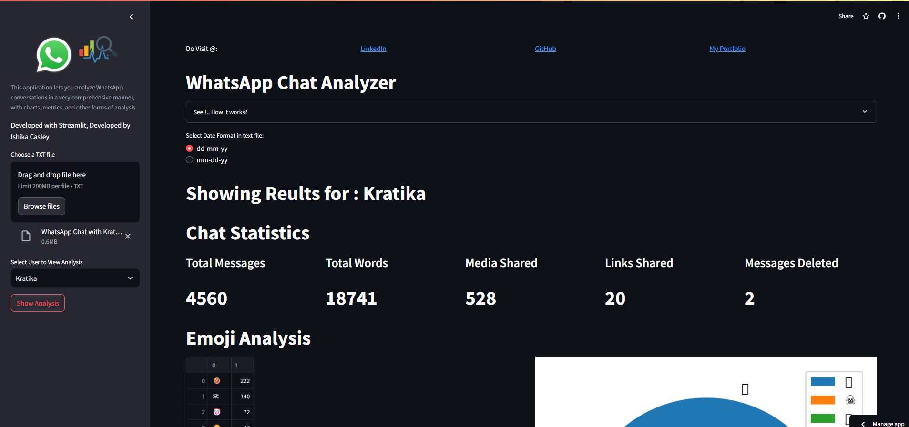
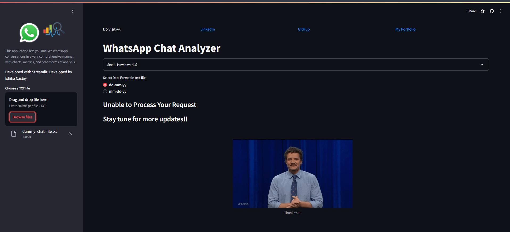

# WhatsApp Chat Analyzer

## Description

The WhatsApp Chat Analyzer is a Streamlit application that provides comprehensive analysis of WhatsApp conversations. It includes features like message statistics, emoji usage, word frequency, and more.

## Features

- Analyze WhatsApp chat files for various metrics.
- View messaging statistics, media shared, and deleted messages.
- Generate visualizations such as emoji analysis, common words, monthly and daily timelines.
- Explore chat activity with word clouds and heatmaps.

## Installation

To run this project locally, follow these steps:

1. Clone the repository:

    ```bash
    git clone https://github.com/Ishikacasley14/ChatVerse-Analyzer.git
    ```

2. Navigate to the project directory:

    ```bash
    cd ChatVerse-Analyzer
    ```

3. Install the required dependencies:

    ```bash
    pip install -r requirements.txt
    ```

## Usage

1. Run the Streamlit app:

    ```bash
    streamlit run app.py
    ```

2. Upload a WhatsApp chat text file and follow the on-screen instructions to analyze the chat.

## Screenshots

### Main Dashboard



### in case of invalid data


## Live Demo

You can view the live demo of the WhatsApp Chat Analyzer application [here](https://ishikacasley14-chatverse-analyzer-main-nxpshp.streamlit.app/).


## Contributing

If you'd like to contribute to this project, please fork the repository and submit a pull request with your changes. 

## Thanks

Special thanks to [karanprasadgupta](https://github.com/karanprasadgupta) .

## License

This project is licensed under the MIT License - see the [LICENSE](LICENSE) file for details.

## Contact

Developed by Ishika Casley

- [LinkedIn](https://www.linkedin.com/in/ishika-casley/)
- [GitHub](https://github.com/Ishikacasley14)
